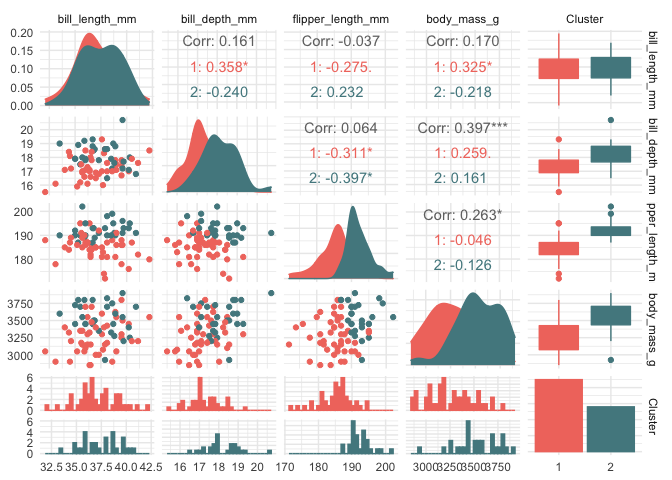

# PCVI

<!-- badges: start -->
[](https://github.com/benhvt/PCVI/actions)
<!-- badges: end -->

# Overview

`PCVI` is a package to ensure valid inference after data clustering.
This problem occurs when clustering force differences beteween groups of
observations to build clusters. This lead to an inflation of the type I
error rate particularly because data are used twice: i) to build
clusters, that is, to build hypothesis and ii) to do the inference step.
The 3 main functions of the package are :

-   `test_selective_inference()` adpated from the work of Gao et
    al. [\[1\]](#1) concerning selective inference for clustering

-   `merge_selective_inference()` for the merging selective test. With
    this method, all the adjacent p-values are merged using harmonic
    mean

-   `test_multimod()` use the DipTest [\[2\]](#2) to investigate the
    presence of a continnum between two estimated clusters on a given
    variable

# Installation

Install the development version from GitHub

``` r
remotes::install_github("benhvt/PCVI")
```

# Example

    ## Registered S3 method overwritten by 'GGally':
    ##   method from   
    ##   +.gg   ggplot2

``` r
data("penguins")
data <- subset(penguins, species == "Adelie" & sex == "female")
data <- data[,3:6]

# Clustering function 
hcl2 <- function(x){
  x <- scale(x, center = T, scale = T)
  distance <- dist(x, method = "euclidean")
  cah <- hclust(distance, method = "ward.D2")
  return(as.factor(cutree(cah, k=2)))
}

data$Cluster <- hcl2(data)

ggpairs(data, aes(colour = Cluster, fill = Cluster)) + 
  scale_colour_manual(values = c("#F1786D","#53888f")) + 
  scale_fill_manual(values = c("#F1786D","#53888f")) + 
  theme_minimal()
```

<!-- -->

# References

<a id="1">\[1\]</a> Gao, L. L., Bien, J., & Witten, D. (2020). Selective
inference for hierarchical clustering. arXiv preprint arXiv:2012.02936.

<a id="2">\[2\]</a> HARTIGAN, John A. et HARTIGAN, Pamela M. The dip
test of unimodality. The annals of Statistics, 1985, p. 70-84.
